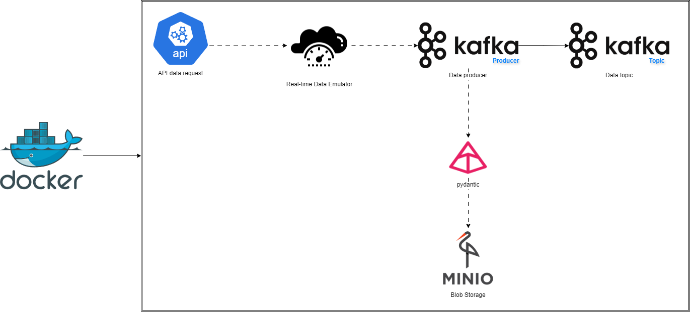

# API Data Retrieval Project

## Overview
This project is designed to retrieve data from an API, process it using **Apache Kafka**, and store the results in **MinIO**. It utilises **Pandas** for data manipulation and analysis. The setup employs **Docker** for containerisation, ensuring a consistent environment across different platforms.

## API Data
The API used for this project is `https://www.thecocktaildb.com/api.php`

## Architecture
The tools used for this project are shown in the diagram that was created using `drawio` below:



## Overview
This project is designed to retrieve data from an API, process it using Kafka, and store the results in MinIO. The setup utilizes Docker for containerization, ensuring a consistent environment across different platforms.

## Project Structure
```
API_retrieval/
│
├── data/
│   │
│   └── minio_data/            # Directory for MinIO data
│
├── docker-compose.yml          # Docker Compose file for orchestrating services
│
├── main.py                     # Main script for data retrieval and processing
│
├── blob_minio.py               # Module for handling MinIO interactions
│
├── run.ps1                     # PowerShell script for Windows setup
│
└── run.sh                      # Bash script for Linux setup
```

## Requirements
- Docker
- Docker Compose
- Python 3.10 or higher (will be set up automatically)

## Setup
1. Clone this repository:
   ```bash
   git clone https://github.com/wiljav/API2CSV.git
   cd API2CSV
   ```
2. Make the script executable (__On macOS/Linux only__) :
     ```bash
     chmod +x run.sh
     ```
3. Run the appropriate script for your operating system:
   - On Windows:
     ```powershell
     .\run.ps1
     ```
   - On macOS/Linux:
     ```bash
     ./run.sh
     ```

## Usage
1. Update the configuration in `main.py` to specify the API endpoint and MinIO bucket details.
2. The main script will run automatically after executing the setup script.

## Troubleshooting
- **Connection issues with MinIO**: Ensure that MinIO is running and accessible at `localhost:9000`.
- **Permission errors**: If you encounter permission issues, check the ownership and permissions of the mounted directories.

## Contributing
Feel free to open issues or submit pull requests for any enhancements or bug fixes.

## License
This project is licensed under the MIT License - see the [LICENSE](LICENSE) file for details.
